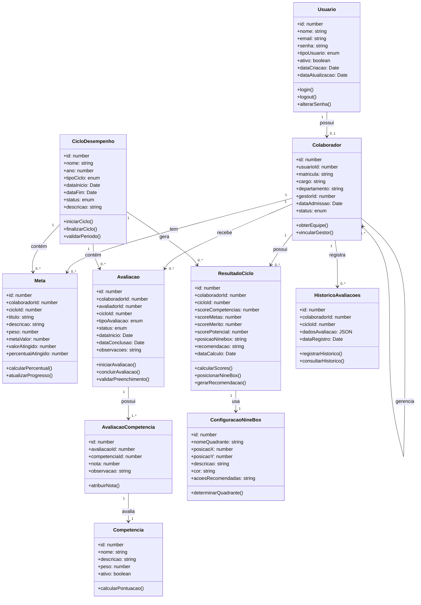

# Diagrama de Classes
## Sistema de Ciclo de Desempenho

## Descrição das Classes Principais

### Usuario
Classe base para todos os usuários do sistema. Contém informações de autenticação e autorização.

**Tipos de Usuário:** GESTOR, RH, COLABORADOR, ADMIN

### Colaborador
Representa os colaboradores da empresa, com suas informações funcionais e hierárquicas.

**Status:** ATIVO, EXPERIENCIA, DESLIGADO

### CicloDesempenho
Define os períodos de avaliação de desempenho.

**Tipos de Ciclo:** ANUAL, SEMESTRAL, EXPERIENCIA

### Competencia
Competências avaliadas no sistema, com pesos configuráveis.

### Meta
Metas individuais dos colaboradores para cada ciclo.

### Avaliacao
Avaliações realizadas pelos gestores.

**Tipos:** AUTO_AVALIACAO, AVALIACAO_GESTOR, AVALIACAO_360

### AvaliacaoCompetencia
Notas atribuídas a cada competência em uma avaliação.

### ResultadoCiclo
Consolidação dos resultados de desempenho de um colaborador em um ciclo.

### ConfiguracaoNineBox
Define os quadrantes da matriz Nine Box e suas características.

### HistoricoAvaliacoes
Mantém o histórico completo de avaliações para auditoria.

## Relacionamentos

- **Usuario → Colaborador**: Um usuário pode ser associado a um colaborador (1:0..1)
- **Colaborador → Colaborador**: Um colaborador (gestor) pode gerenciar vários colaboradores (1:N)
- **Colaborador → Meta**: Um colaborador tem várias metas (1:N)
- **Colaborador → Avaliacao**: Um colaborador recebe várias avaliações (1:N)
- **CicloDesempenho → Avaliacao**: Um ciclo contém várias avaliações (1:N)
- **Avaliacao → AvaliacaoCompetencia**: Uma avaliação possui várias notas de competências (1:N)
- **ResultadoCiclo → ConfiguracaoNineBox**: Um resultado usa uma configuração Nine Box (N:1)

## Padrões de Design Utilizados

1. **Repository Pattern**: Separação da lógica de acesso a dados
2. **Service Layer**: Lógica de negócio centralizada
3. **DTO (Data Transfer Objects)**: Objetos para transferência de dados
4. **Strategy Pattern**: Para diferentes tipos de avaliação e cálculos
